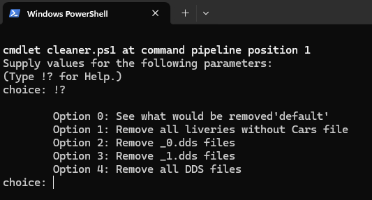

# ACC Livery Folder Clean Up Script
Removes ACC livery files for which a cars file does not exist. Available as a Python script (`cleaner.py`) or a PowerShell script (`cleaner.ps1`) — use whichever you prefer.

## Running the PowerShell script (cleaner.ps1)

PowerShell comes built into Windows — no extra installs needed.

### 1. Download the script
1. On this page, click the green **Code** button near the top right
2. Select **Download ZIP**
3. Once downloaded, right-click the ZIP file and select **Extract All**
4. Choose a location you can easily find (e.g. your Desktop) and click **Extract**

### 2. Run the script
Right-click `cleaner.ps1` and select **Run with PowerShell**. A menu will appear — enter the number for the option you want and press Enter.

### 3. Options
| Option Number | Description |
| :--- | :--- |
| **0** | Allows code to be ran and log what WOULD be deleted but does NOT remove ANYTHING; Writes out to the log file "$env:USERPROFILE\Documents\Assetto Corsa Competizione\Customs\ACC_LIVERIES_CLEAN_UP.LOG" |
| **1** | Remove all liveries without Cars file  |
| **2** | Remove all *_0.dds files |
| **3** | Remove all *_1.dds files |
| **4** | Removes all DDS files |

### 4. Example Output and LogFile





### Troubleshooting: "script cannot be loaded because running scripts is disabled"
Windows blocks PowerShell scripts by default. To fix this:
1. Press `Win + S`, search for **PowerShell**, right-click it and select **Run as administrator**
2. Paste this command and press Enter:
   ```
   Set-ExecutionPolicy RemoteSigned
   ```
3. Type `Y` and press Enter to confirm
4. Try running `cleaner.ps1` again
5. Built in Help
```powershell
   # for Basic help
   Get-Help ./cleaner.ps1

   #for Full help
   Get-Help ./cleaner.ps1 -Full
```

---

## Running the Python script (cleaner.py)

This is identical to the PowerShell script, if you prefer to run the python script for any reason or have python installed on your computer.

### 1. Download the script
1. On this page, click the green **Code** button near the top right
2. Select **Download ZIP**
3. Once downloaded, right-click the ZIP file and select **Extract All**
4. Choose a location you can easily find (e.g. your Desktop) and click **Extract**

### 2. Install Python
1. Go to [python.org/downloads](https://www.python.org/downloads/) and download the latest Python installer
2. Run the installer — **make sure to check "Add python.exe to PATH"** before clicking Install Now
3. Once installed, open **Command Prompt** (`Win + R`, type `cmd`, press Enter) and verify it worked:
   ```
   python --version
   ```

### 3. Run the script
1. Open the extracted folder and copy its file path from the address bar at the top of File Explorer
2. Open **Command Prompt** (`Win + R`, type `cmd`, press Enter)
3. Type `cd ` (with a space), paste the path, and press Enter:
   ```
   cd "C:\Users\YourName\Desktop\acc_liveries_clean_up"
   ```
4. Run the script:
   ```
   python cleaner.py
   ```
   If that doesn't work, try:
   ```
   python3 cleaner.py
   ```
5. Enter the number for the option you want and press Enter

## Options

| Option | What it does |
|--------|-------------|
| **1** (default) | Deletes livery folders you have no car file for — the ones you can't select in the menu anyway. Safe to run and the quickest way to free up space. |
| **2** | Deletes all `_0.dds` files (preview thumbnails). ACC regenerates these automatically the next time you open the livery in the menu. |
| **3** | Deletes all `_1.dds` files (in-game skin textures). ACC regenerates these the next time you drive with that livery on track. |
| **4** | Deletes all DDS files (both `_0` and `_1`). Use this for the most space savings — ACC will regenerate everything as you use each livery. |
